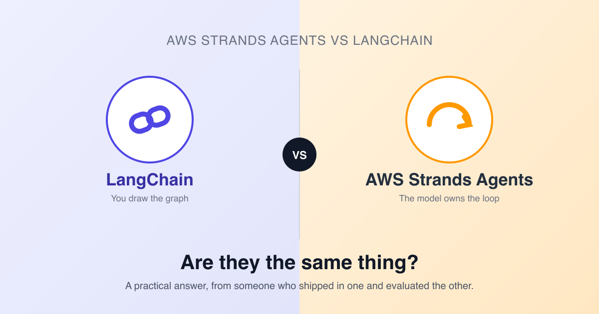

# strands-vs-langchain



Companion repo for the article **"AWS Strands Agents vs LangChain: A Practical Guide to Choosing the Right Framework"** on AWS Builder Center.

Same two agents, built twice — once in each framework — so you can run them side by side and feel the difference in boilerplate and control flow for yourself.

## Structure

```
strands/
  weather_agent.py         # minimal single-tool agent (Amazon Bedrock)
  weather_agent_ollama.py  # same agent, running on Ollama (free, local)
  multi_tool_agent.py      # weather + currency conversion
langchain/
  weather_agent.py       # same task, LangChain version
  multi_tool_agent.py    # same task, LangChain version
images/                  # diagrams and screenshots used in the article
requirements.txt
.env.example
```

| File | What it shows |
|---|---|
| `strands/weather_agent.py` | The smallest possible Strands agent — a model, one tool, no graph. |
| `strands/weather_agent_ollama.py` | The same agent, pointed at a local Ollama model instead of Bedrock — no AWS account needed. |
| `strands/multi_tool_agent.py` | The model deciding on its own which of two tools to call, and in what order. |
| `langchain/weather_agent.py` | The same single-tool task, with the prompt template + executor LangChain expects you to assemble. |
| `langchain/multi_tool_agent.py` | Same two-tool task as the Strands version — compare the boilerplate side by side. |

## Setup

```bash
git clone https://github.com/carlicode/strands-vs-langchain.git
cd strands-vs-langchain

python3 -m venv .venv
source .venv/bin/activate      # Windows: .venv\Scripts\activate

pip install -r requirements.txt
```

### Credentials

Copy `.env.example` to `.env` and fill in your own values — `.env` is gitignored, so your keys never get committed.

```bash
cp .env.example .env
```

- **LangChain** examples need `OPENAI_API_KEY` set in `.env`.
- **Strands** examples (`weather_agent.py`, `multi_tool_agent.py`) call Amazon Bedrock through your default AWS credential chain (`aws configure` or AWS SSO). You only need to touch `.env` if you want to override the profile or region (`AWS_PROFILE`, `AWS_REGION`) instead of using your default AWS setup.
- **`strands/weather_agent_ollama.py`** needs no cloud account — it runs against a local [Ollama](https://ollama.ai) server instead:
  ```bash
  ollama pull llama3.1
  ollama serve
  ```
  Override `OLLAMA_HOST` / `OLLAMA_MODEL_ID` in `.env` if your server or model differs from the defaults.

### Run

```bash
# Strands (Bedrock)
python strands/weather_agent.py
python strands/multi_tool_agent.py

# Strands (Ollama, free/local — needs `ollama serve` running)
python strands/weather_agent_ollama.py

# LangChain
python langchain/weather_agent.py
python langchain/multi_tool_agent.py
```

## Why this repo exists

Read the full breakdown in the article — this repo is here so you don't have to take the comparison on faith. Clone it, run both, and see which control-flow model feels right for your use case.

📖 **Article:** *AWS Strands Agents vs LangChain: A Practical Guide to Choosing the Right Framework* — link added once it's live on AWS Builder Center.
