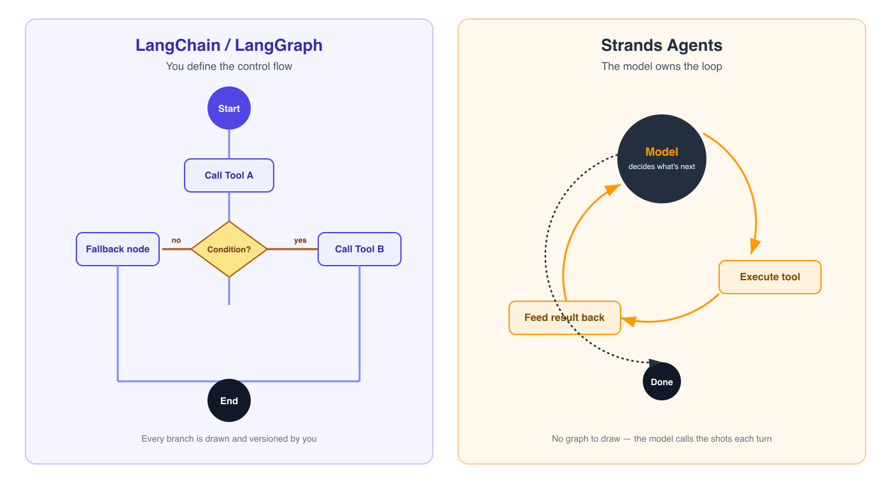
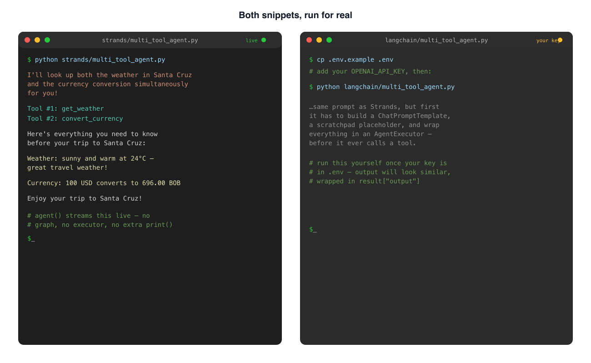
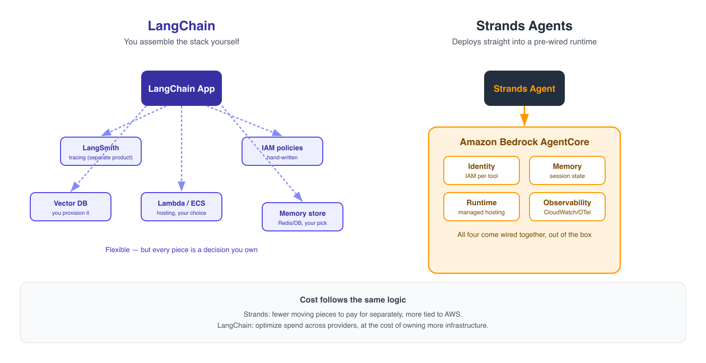
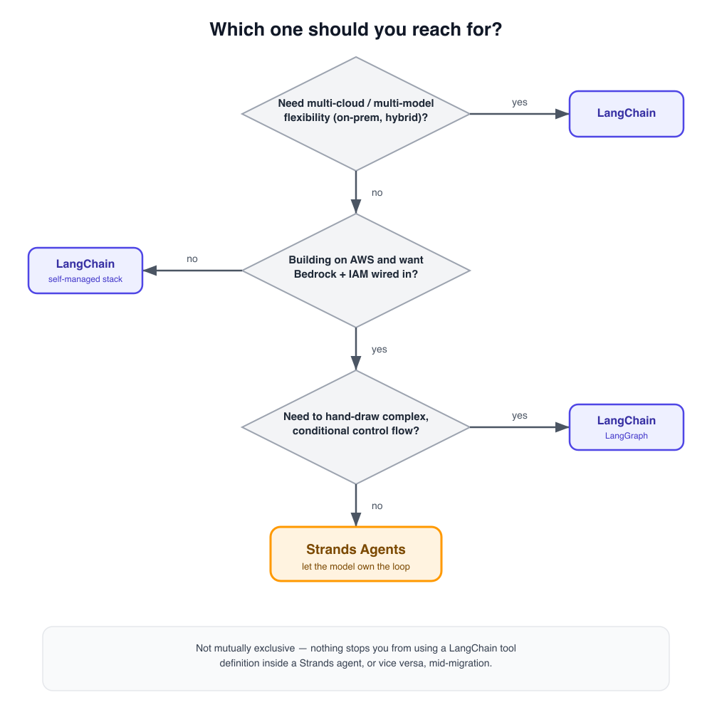

# AWS Strands Agents vs LangChain: A Practical Guide to Choosing the Right Framework

*Are they even the same thing? I asked myself that the first time I saw Strands' tool-calling loop — after months of building agents in LangChain at work.*

## Introduction

I learned LangChain on the job. It was the framework everyone pointed to when "AI agent" started showing up in sprint planning, and for a while it was simply *the* way you built anything agentic. Chains, tools, memory, LangGraph for the harder stuff — I got comfortable with the mental model.

Then I ran into **AWS Strands Agents**, and the way it connected an agent to a tool looked suspiciously simple. No graph to draw. No chain to assemble. Just a model, a list of tools, and a loop. My first honest reaction was: *wait, is this the same thing with a different name, or is something fundamentally different happening here?*

That question is the reason this article exists. Not a spec sheet comparison — a practical answer, from someone who shipped things in one and is now evaluating the other.


**TL;DR:** LangChain gives you explicit control over how an agent reasons — you draw the graph. Strands gives the model the wheel — you describe the tools and let the model decide the loop. Neither is "better"; they optimize for different things, and if you're on AWS, Strands removes a surprising amount of scaffolding.

## Core Philosophy: Explicit Graphs vs. the Model-Driven Loop

This is the part that actually answers my original question — they are *not* the same thing wearing different clothes.

**LangChain** (and especially **LangGraph**, its orchestration layer) asks *you* to define the control flow. You describe nodes, edges, conditional branches. The agent's "reasoning path" is a graph you built and can inspect, line by line. This gives you precision: you know exactly what can happen next at every step, because you wrote the possibilities down.

**Strands Agents** flips that. You give the model a system prompt, a set of tools, and Strands runs a loop: the model decides whether to respond or call a tool, executes it, feeds the result back, and repeats until the model decides it's done. There's no graph to draw — the *model* is the orchestrator. Strands' job is to make that loop reliable, observable, and easy to wire into AWS services.



That's the real distinction: **who owns the control logic — you, or the model.** Everything else in this article follows from that one decision.

## Developer Experience: Boilerplate and Debugging

The difference in philosophy shows up immediately in how much code you write to get a basic agent running.

**LangChain**, minimal agent with a tool:

```python
from langchain_openai import ChatOpenAI
from langchain.agents import create_tool_calling_agent, AgentExecutor
from langchain_core.tools import tool
from langchain_core.prompts import ChatPromptTemplate

@tool
def get_weather(city: str) -> str:
    """Returns the current weather for a city."""
    return f"It's sunny in {city}."

llm = ChatOpenAI(model="gpt-4o")
prompt = ChatPromptTemplate.from_messages([
    ("system", "You are a helpful assistant."),
    ("human", "{input}"),
    ("placeholder", "{agent_scratchpad}"),
])

agent = create_tool_calling_agent(llm, [get_weather], prompt)
executor = AgentExecutor(agent=agent, tools=[get_weather])
executor.invoke({"input": "What's the weather in Santa Cruz?"})
```

**Strands Agents**, same task:

```python
from strands import Agent, tool

@tool
def get_weather(city: str) -> str:
    """Returns the current weather for a city."""
    return f"It's sunny in {city}."

agent = Agent(tools=[get_weather])
agent("What's the weather in Santa Cruz?")
```

That gap — prompt templates, scratchpads, an explicit executor vs. an agent object you just call — is exactly what threw me off at first. It's not that Strands is "missing features." It's that Strands assumes the model can drive the loop, so it doesn't ask you to describe it.



*The Strands panel is a real run against Amazon Bedrock (output captured verbatim). The LangChain panel is left for you to run yourself — drop your `OPENAI_API_KEY` in `.env` and it'll produce the same kind of output, just wrapped in more scaffolding to get there.*

On **debugging and observability**: LangChain leans on LangSmith for tracing chains and runs — powerful, but it's another product to set up and another dashboard to check. Strands integrates with **CloudWatch** and OpenTelemetry-based tracing out of the box if you're already on AWS. The observability question often just becomes: do you already live in the AWS console, or not?

## Deployment on AWS: Bedrock AgentCore vs. Self-Managed

This is where the AWS-native angle stops being a nice-to-have and starts being the deciding factor for a lot of teams.

Strands was built with **Amazon Bedrock AgentCore** in mind: identity, memory, and runtime for agents come pre-wired. You get IAM-based permissions on tools, built-in session management, and a deployment path that doesn't require you to stitch together your own infrastructure. If your team already runs on Bedrock, Strands feels less like "a new framework to learn" and more like "the SDK that was always supposed to exist."

LangChain, by contrast, is deliberately **cloud-and-model agnostic**. You can run it on Bedrock, OpenAI, Anthropic directly, self-hosted models, whatever — but that flexibility means *you* own the deployment story. No default runtime, no default memory layer; you assemble it (often with LangGraph Platform, or your own Lambda/ECS setup).



Cost follows the same logic: Strands' AWS-native path can mean fewer moving pieces to pay for separately, but you're also more tied to the AWS ecosystem. LangChain's flexibility can save money if you're optimizing across providers, at the cost of more infrastructure to own.

## When to Choose Each

**Choose LangChain if:**
- You need to stay model- and cloud-agnostic (multi-provider, on-prem, hybrid).
- Your workflow needs genuinely complex, conditional control flow that you want to inspect and version as a graph (LangGraph shines here).
- Your team already has LangChain expertise and working infrastructure — the migration cost of switching isn't worth it yet.

**Choose Strands Agents if:**
- You're building on AWS and want Bedrock, IAM, and observability wired in from day one.
- You'd rather describe tools and intent and let the model handle the reasoning loop, instead of hand-drawing it.
- You're prototyping fast and want to go from idea to a deployed agent with the least scaffolding possible.

They're not mutually exclusive, either — nothing stops you from using a LangChain tool definition inside a Strands agent, or vice versa, if your team is mid-migration.



## Try It Yourself

I put both versions of this weather agent — plus a slightly more realistic multi-tool example — in a repo so you can run them side by side instead of taking my word for it. Clone it, spin up a virtualenv, drop your own key in `.env`, and run both:

**Repo:** [github.com/carlicode/strands-vs-langchain](https://github.com/carlicode/strands-vs-langchain)

## Conclusion

Going back to my original question: no, they are not the same thing wearing different clothes. LangChain hands you the pen and asks you to draw the reasoning path. Strands hands the model the pen and focuses on making that loop safe, observable, and — if you're on AWS — nearly deployment-ready out of the box.

I don't think the right takeaway is "switch." It's: know which one you're actually reaching for, and why. If you're the version of me from a few months ago, deep in LangChain and just curious about this new AWS-native option — try rebuilding one small agent you already have, in Strands, this week. That's the fastest way to feel the difference for yourself.

---
*Have you used Strands Agents in production yet? I'd love to hear about your experience in the comments.*
